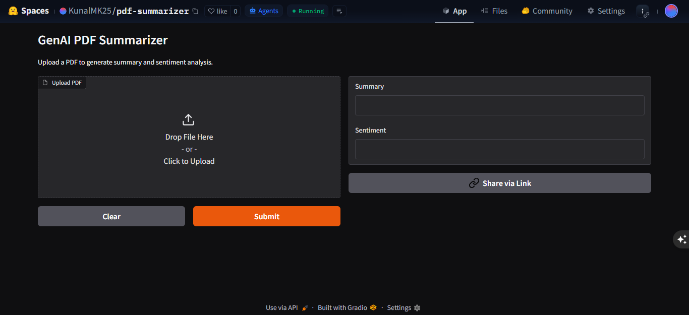
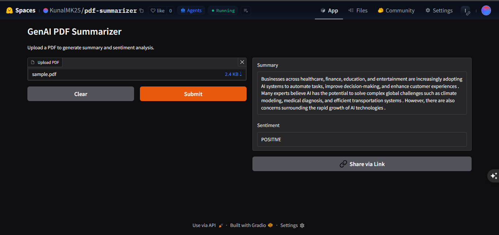

# 📄 GenAI PDF Summarizer & Sentiment Analyzer

An AI-powered web app that summarizes PDF documents and performs sentiment analysis using Hugging Face Transformers and Gradio.

## 🚀 Live Demo

👉 Hugging Face Space:  
https://huggingface.co/spaces/KunalMK25/pdf-summarizer

---

## ✨ Features

- 📄 Upload PDF files
- 🧠 AI-generated summaries
- 😊 Sentiment analysis (Positive / Negative)
- ⚡ Lightweight transformer models
- 🌐 Interactive Gradio web interface
- ☁️ Deployable on Hugging Face Spaces

---

## 🛠️ Tech Stack

- Python
- Gradio
- Hugging Face Transformers
- PyPDF
- Torch

---

## 📦 Models Used

### Summarization
- `Falconsai/text_summarization`

### Sentiment Analysis
- `distilbert-base-uncased-finetuned-sst-2-english`

---

## 📂 Project Structure

```bash
genai_project/
│
├── app.py
├── requirements.txt
├── README.md
├── .gitignore
└── sample.pdf
```

---

## ⚙️ Installation

Clone the repository:

```bash
git clone https://github.com/YOUR_USERNAME/genai-pdf-summarizer.git
cd genai-pdf-summarizer
```

Create virtual environment:

```bash
python -m venv venv
```

Activate virtual environment:

### Windows
```bash
venv\\Scripts\\activate
```

Install dependencies:

```bash
pip install -r requirements.txt
```

Run the application:

```bash
python app.py
```

---

## 🌍 Deployment

This project is deployed using:

- Hugging Face Spaces
- Gradio SDK

---

## 📸 Screenshots

Add screenshots here later.

---

## 🎯 Future Improvements

- Chat with PDF
- OCR support
- Better summarization models
- Dark mode UI improvements
- Download summary as text/PDF

---

## 📸 Screenshots

### Home Interface



---

### PDF Analysis Result



## 👨‍💻 Author

Kunal